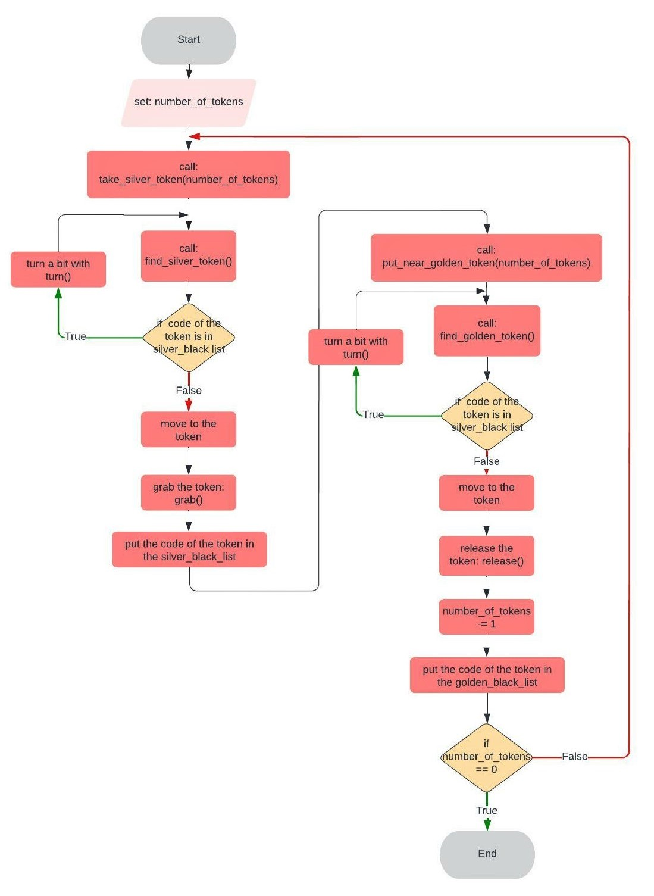

Python Robotics Simulator
================================

First Research Track Assignment
----------------------

This first assignment is designed to give us a first taste of the Research Track's course. The goal is to implement a simple algorithm that will allow the robot to grab a silver token and put it near a golden token for a several number of times. The robot has two wheels controlled by independent motors to move around the arena. The fact that they are independent allows you to move the robot forwards and backwards but also to rotate it. It also has a grabber to take the tokens, transport them and drop them at the desired point. 
The functions that allow you to control all the components and movements of the robot are explained below

Installing
----------------------

The simulator requires a Python 2.7 installation, the [pygame](http://pygame.org/) library, [PyPyBox2D](https://pypi.python.org/pypi/pypybox2d/2.1-r331), and [PyYAML](https://pypi.python.org/pypi/PyYAML/).

Pygame, unfortunately, can be tricky (though [not impossible](http://askubuntu.com/q/312767)) to install in virtual environments. If you are using `pip`, you might try `pip install hg+https://bitbucket.org/pygame/pygame`, or you could use your operating system's package manager. Windows users could use [Portable Python](http://portablepython.com/). PyPyBox2D and PyYAML are more forgiving, and should install just fine using `pip` or 
`easy_install`.

------------------------------------------------------------

How to run the code 
----------------------

To run the program in the simulator, use `run.py`, passing it the file names. 

```bash
$ python2 run.py assignment.py
```
It is neccesay to be in the folder that contain the program!

------------------------------------------------------------

Robot API
---------

The API for controlling a simulated robot is designed to be as similar as possible to the [SR API][sr-api].

### Motors ###

The simulated robot has two motors configured for skid steering, connected to a two-output [Motor Board](https://studentrobotics.org/docs/kit/motor_board). The left motor is connected to output `0` and the right motor to output `1`.

The Motor Board API is identical to [that of the SR API](https://studentrobotics.org/docs/programming/sr/motors/), except that motor boards cannot be addressed by serial number. So, to turn on the spot at one quarter of full power, one might write the following:

```python
R.motors[0].m0.power = 25
R.motors[0].m1.power = -25
```

### The Grabber ###

The robot is equipped with a grabber, capable of picking up a token which is in front of the robot and within 0.4 metres of the robot's centre. To pick up a token, call the `R.grab` method:

```python
success = R.grab()
```

The `R.grab` function returns `True` if a token was successfully picked up, or `False` otherwise. If the robot is already holding a token, it will throw an `AlreadyHoldingSomethingException`.

To drop the token, call the `R.release` method.

Cable-tie flails are not implemented.

### Vision ###

To help the robot find tokens and navigate, each token has markers stuck to it, as does each wall. The `R.see` method returns a list of all the markers the robot can see, as `Marker` objects. The robot can only see markers which it is facing towards.

Each `Marker` object has the following attributes:

* `info`: a `MarkerInfo` object describing the marker itself. Has the following attributes:
  * `code`: the numeric code of the marker.
  * `marker_type`: the type of object the marker is attached to (either `MARKER_TOKEN_GOLD`, `MARKER_TOKEN_SILVER` or `MARKER_ARENA`).
  * `offset`: offset of the numeric code of the marker from the lowest numbered marker of its type. For example, token number 3 has the code 43, but offset 3.
  * `size`: the size that the marker would be in the real game, for compatibility with the SR API.
* `centre`: the location of the marker in polar coordinates, as a `PolarCoord` object. Has the following attributes:
  * `length`: the distance from the centre of the robot to the object (in metres).
  * `rot_y`: rotation about the Y axis in degrees.
* `dist`: an alias for `centre.length`
* `res`: the value of the `res` parameter of `R.see`, for compatibility with the SR API.
* `rot_y`: an alias for `centre.rot_y`
* `timestamp`: the time at which the marker was seen (when `R.see` was called).

For example, the following code lists all of the markers the robot can see:

```python
markers = R.see()
print "I can see", len(markers), "markers:"

for m in markers:
    if m.info.marker_type in (MARKER_TOKEN_GOLD, MARKER_TOKEN_SILVER):
        print " - Token {0} is {1} metres away".format( m.info.offset, m.dist )
    elif m.info.marker_type == MARKER_ARENA:
        print " - Arena marker {0} is {1} metres away".format( m.info.offset, m.dist )
```

----------------------------------------------------------

Main of the Program and Function
---------
There are two functions that allow the robot to take, one at a time, all the silver tokens and place them next to the gold tokens. Once all tokens have been placed the program ends.

### Main ###
The main create the `silver_black_list`, the `golden_black_list`, set the `number_of_tokens` (half of the total tokens, because half are silver and half are golden) and call the take_silver_token function.
The program works by recursively calling the functions `take_silver_token` and `put_near_golden_token`.
The exit and termination condition occurs when number_of_tokens is equal to `0`.

The main of the program is the following:
```python
silver_black_list = list()  # a list to mark the silver token already taken 
golden_black_list = list()  # a list to mark the golden token already taken 
number_of_tokens = 6        # in this particular execution of the program the number of tokens is 6

take_silver_token(number_of_tokens)
```

### Take a silver token ###
The function `take_silver_token` is use to:
1) call the `find_silver_token` function and find a silver token 
2) go get the silver token, if the code of the silver token is not yet in the `silver_black_list` else turn a bit and find another token starting over from the point above
3) mark the code of the silver token in the corresponding list (`silver_black_list`)
4) call the `put_near_golden_token` function to put the silver token near a golden token and pass it the `number_of_tokens`.

```python
def take_silver_token(number_of_tokens):
    while 1:
        dist, rot_y, code = find_silver_token()
        if code not in silver_black_list:
            if dist == -1: # if no token is detected, we make the robot turn 
	            print("I don't see any token!!")
	            turn(+10, 1)
            elif dist < d_th: # if we are close to the token, we try grab it.
                print("Found it!")
                R.grab() # if we grab the token, we move the robot forward and on the right, we release the token, and we go back to the initial position
                print("Gotcha!")
                silver_black_list.append(code)
                put_near_golden_token(number_of_tokens)
            elif -a_th <= rot_y <= a_th: # if the robot is well aligned with the token, we go forward
                print("Ah, that'll do.")
                drive(25, 0.5)
            elif rot_y < -a_th: # if the robot is not well aligned with the token, we move it on the left or on the right
                print("Left a bit...")
                turn(-2, 0.5)
            elif rot_y > a_th:
                print("Right a bit...")
                turn(+2, 0.5)
        else:
            turn(+10, 1)
```

### Put a silver token near a golden token ###
This function `put_near_golden_token` is use to:
1) call the `find_golden_token` function and find a golden token
2) go and release the silver token, already taken, next to the found golden token, if the code of the golden token is not yet in the `golden_black_list` else turn a bit and find another token starting over from the point above
3) decrease the `number_of_token` of `1` to mark that, a pair of golden and silver tokens has been created 
4) mark the code of the golden token in the corresponding list (`golden_vlack_list`)
5) check if the number_of_tokens is equal to 0 and in this case the program is over, otherwise call again the `take_silver_token` function to find the next silver token to pair with a golden token and pass it the current `number_of_tokens`.

```python
def put_near_golden_token(number_of_tokens):
    while 1:
        dist, rot_y, code = find_golden_token()
        if code not in golden_black_list:
            if dist == -1: # if no token is detected, we make the robot turn 
	            print("I don't see any token!!")
	            turn(+10, 1)
            elif dist < d_th + 0.2: # if we are close to the token, we try grab it.
                print("Found it!")
                R.release()
                print("Release")
                drive(-10, 1)
                number_of_tokens -= 1
                golden_black_list.append(code)
                if number_of_tokens == 0:
                    print("You have finish")
                    exit()
                else:
                    take_silver_token(number_of_tokens)
                    break
            elif -a_th <= rot_y <= a_th: # if the robot is well aligned with the token, we go forward
	        print("Ah, that'll do.")
                drive(25, 0.5)
            elif rot_y < -a_th: # if the robot is not well aligned with the token, we move it on the left or on the right
                print("Left a bit...")
                turn(-2, 0.5)
            elif rot_y > a_th:
                print("Right a bit...")
                turn(+2, 0.5)
        else:
            turn(+10, 1)
```

### Find a silver token and a golden token ###
The functions `find_silver_token` and `find_golden_token` are use to find the closest silver and golden token.
The functions have no input arguments and have three return values:

  - dist (float): distance of the closest silver token (-1 if no silver token is detected)
  - rot_y (float): angle between the robot and the silver token (-1 if no silver token is detected)
  - t (int): the code of the token (-1 if no silver token is detected)

```python
def find_silver_token():
    dist=100
    for token in R.see():
        if token.dist < dist and token.info.marker_type is MARKER_TOKEN_SILVER:
            dist = token.dist
            rot_y = token.rot_y
            t = token.info.code
    if dist==100:
        return -1, -1, -1
    else:
	    return dist, rot_y, t
```
```python
def find_golden_token():
    dist=100
    for token in R.see():
        if token.dist < dist and token.info.marker_type is MARKER_TOKEN_GOLD:
            dist=token.dist
            rot_y=token.rot_y
            t = token.info.code
    if dist==100:
	    return -1, -1, -1
    else:
   	    return dist, rot_y, t
```

---------------------------------------------------------
Flowchart
---------
Here is the flowchart of the program:


---------------------------------------------------------
Future Implementation
---------
The program could be improved by:
-  by adding a function that allows the robot to find the nearest silver token around it and take it.
-  by adding a function that allows the robot to find the nearest golden token around it and put the silver token near it.
In this way the robot could be more rapid and take less time to complete the task.