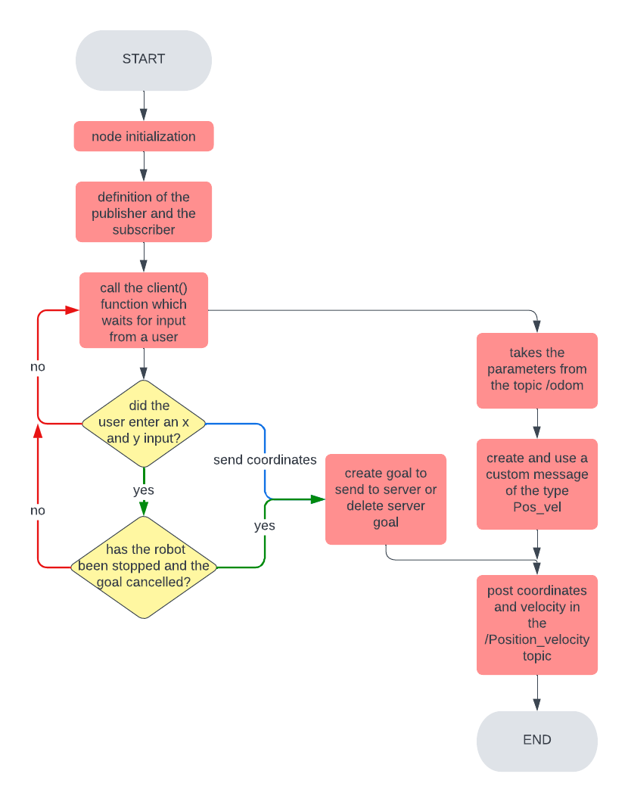

# ROS Robotics Simulator

## Ivan Terrile

### Second Research Track Assignment 
In this project the user is able to control a mobile robot in 3D simulation environment called *Gazebo*.
To do this the assignment requires to implement:
- (a) A node that implements an action client, allowing the user to set a target (x, y) or to cancel it. The node
also publishes the robot position and velocity as a custom message (x,y, vel_x, vel_z), by relying on the values
published on the topic /odom.
- (b) A service node that, when called, prints the number of goals reached and cancelled;
- (c) A node that subscribes to the robot’s position and velocity  and prints the
distance of the robot from the target and the robot’s average speed. 

Below you can see the structure of all the program but you can also see the documentation at this link: [https://ivanterrile.github.io/ResearchTrack1/](https://ivanterrile.github.io/ResearchTrack1/)

### Nodes of ROS program

Inside the scripts folder, there will be 6 nodes:

- `bug_as.py` is the file which implements the action server node.The node receives the desired position from the client and calls the useful services in oreder to bring the robot to the given position.The position is set  as a ROS parameter.
- `input_from_user.py` is the file which implements the action client node. The node asks the user to enter two coordinates (x,y) or to cancel them.After,it publishes the robot position and velocity as a custom message on the /*Position_velocity* topic, getting the values from the /*odom* topic. The structure of the node is described in the suqsequent flowchart:
  
<figure>

<figcaption align = "center"></figcaption>
</figure>
<br/><br/><br/>

- `information.py` is the file which implements the info node.The node prints on the console the distance between the actual position of the robot and the desired position and the average speed of the robot.These parameters are taken from the 
*/Position_velocity* topic as a custom message.The frequency of printing is set as a parameter in the launch file.
- `go_to_point_service.py` is the file which implements a service node.When the node is called,it makes the robot moves to the desired position.
- `wall_follow_service.py` is the file which implements a service node.When the node is called,it makes the robot moves around an obstacle like a wall. 
- `service.py` is the file which implements a service node.When the node is called,it prints how many times a desired position was reached or cancelled.

To get the information about the number of goals reached and canceled, write on a command window:
    
```bash
$ rosservice call service
```

## Installation and how to run of the code

To run the master:
    
```bash
$ roscore 
```

To install the module, you need to go inside the `src` folder of your ROS workspace and clone the assignment folder:

```bash
$ git clone https://github.com/IvanTerrile/ResearchTrack1/tree/main/SecondAssignment
```
and from the root directory of your ROS workspace run the command:

```bash
$ catkin_make
```
    
To run the program, it is neccessary to install **xterm**:
    
```bash
$ sudo apt-get install xterm
```
    
To run the code:

```bash
$ roslaunch assignment_2_2022 assignment1.launch
```

### Possible improvements

Here are some possible improvements that could be made to the program:

- increase the speed of movement and rotation of the robot;

- give limitations to the coordinates entered by the user (define the limits of the map) and then carry out the necessary checks on the user's input;

- prohibit some coordinates (those where there are obstacles, for example walls)
